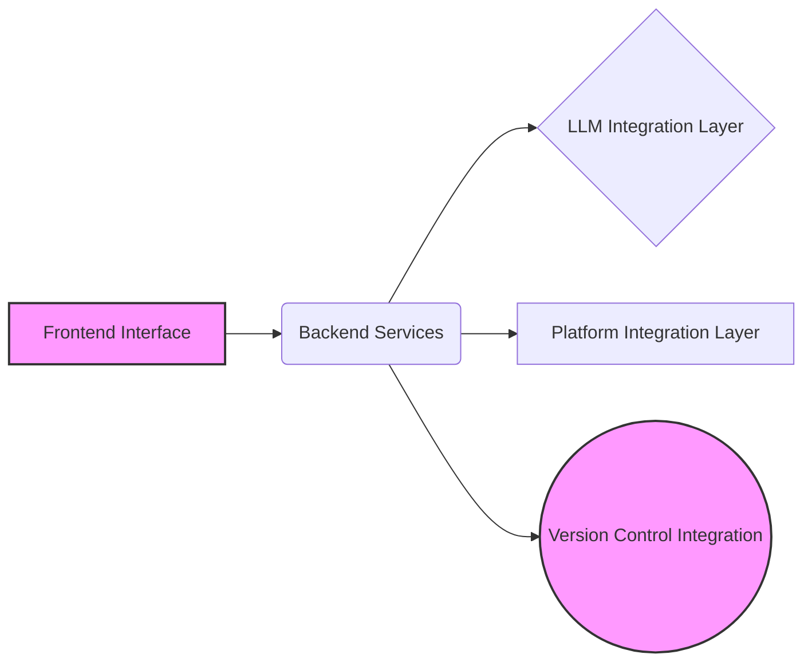
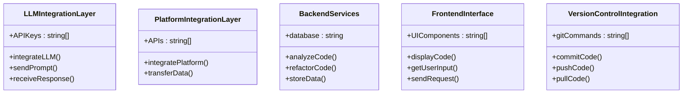
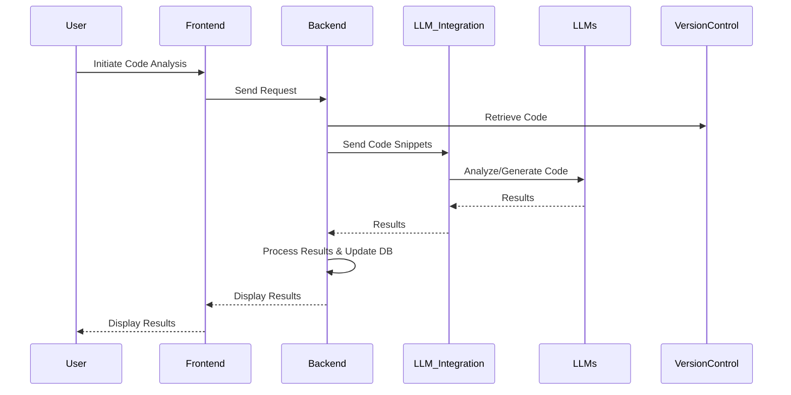

# Shotgun Code: AI-Powered Code Refactoring and Optimization

> Revolutionize your codebase management with Shotgun Code, an AI-powered tool for automated code analysis, modification, and optimization. Improve developer productivity, code maintainability, and software quality.

## Table of Contents

1.  [Introduction](#introduction)
    *   [Context](#context)
    *   [Historical Background](#historical-background)
    *   [Current Relevance](#current-relevance)
2.  [Technical Deep Dive](#technical-deep-dive)
    *   [Architecture](#architecture)
    *   [Components](#components)
        *   [LLM Integration Layer](#llm-integration-layer)
        *   [Platform Integration Layer](#platform-integration-layer)
        *   [Backend Services](#backend-services)
        *   [Frontend Interface](#frontend-interface)
        *   [Version Control Integration](#version-control-integration)
    *   [Implementation](#implementation)
3.  [Integration & Use Cases](#integration--use-cases)
    *   [Integration Scenarios](#integration-scenarios)
    *   [Use Cases](#use-cases)
4.  [Performance & Benchmarks](#performance--benchmarks)
    *   [Performance Metrics](#performance-metrics)
    *   [Optimization Tips](#optimization-tips)
5.  [Future Implications](#future-implications)
6.  [Expert Insights](#expert-insights)
7.  [References & Citations](#references--citations)
8.  [Related Topics](#related-topics)
9.  [FAQ](#faq)

## Executive Summary

*Shotgun Code* is an *AI-powered* tool designed to revolutionize large-scale *codebase management*, particularly within poorly documented or *legacy systems*. By leveraging *Large Language Models (LLMs)*, it automates *code analysis*, *modification*, and *optimization*, leading to significant improvements in *developer productivity*, *code maintainability*, and overall *software quality*. This document provides a comprehensive overview of *Shotgun Code*, covering its *architecture*, key *capabilities*, *integration* potential, and its role in advancing *AI-assisted software development*.

## Introduction

### Context

In modern *software development*, managing large and complex *codebases* presents significant challenges. *Legacy systems*, often poorly documented and difficult to maintain (*"spaghetti code"*), contribute to *technical debt* and hinder innovation. The increasing demand for faster development cycles necessitates tools that can automate and streamline code-related tasks. *Shotgun Code* emerges as a solution by employing *AI* to address these challenges, offering a more efficient and intelligent approach to *codebase management*.

[Jump to section: Architecture](#architecture)

### Historical Background

The concept of *AI-assisted coding* has evolved significantly in recent years. Early attempts at automated *code generation* were limited by the capabilities of the underlying algorithms. However, the advent of *Large Language Models (LLMs)* has opened new possibilities, enabling more sophisticated *code analysis*, *modification*, and *generation*. *Shotgun Code* builds on this foundation, leveraging the power of *LLMs* to provide a comprehensive solution for *codebase management*. Competitors, like *GitHub Copilot* and *Tabnine*, offer *AI*-driven *code completion* and suggestions, but *Shotgun Code* distinguishes itself with its focus on *large-scale refactoring*, *legacy system modernization*, and complete *codebase analysis*.

### Current Relevance

*Shotgun Code* addresses the growing need for efficient *code management* and *refactoring*, especially in large and complex projects. By automating analysis, modification, and optimization, it saves time, reduces errors, and enhances overall *developer productivity*. The tool is particularly useful in projects with poorly documented or *legacy systems*, offering a glimpse into a future where *refactoring* is streamlined and more innovative. According to market analysis, the *AI-assisted coding* market is expected to grow substantially in the coming years, making *Shotgun Code* a timely and relevant solution [Citation Needed].

## Technical Deep Dive

### Architecture

*Shotgun Code* is engineered for adaptability, emphasizing seamless *integration* into existing *software development* workflows. The *architecture* promotes modularity and scalability, allowing for easy *integration* of new features and technologies.



*Figure 1: High-level overview of the Shotgun Code architecture.*

### Components

*Shotgun Code's* *architecture* consists of five key components:

#### LLM Integration Layer

This layer handles the *integration* with various *Large Language Models (LLMs)* such as *Gemini 2.5 Pro*, *ChatGPT*, and *Claude*. This layer is responsible for sending *code snippets* and prompts to the *LLMs* and receiving the generated *code* or analysis results. *Prompt engineering* plays a key role here, ensuring that the *LLMs* provide relevant and accurate responses.

*   **Technical Details:** Utilizes *API* calls and potentially *SDKs* specific to each *LLM* provider. Requires *authentication* and *authorization* mechanisms to securely access the *LLMs*. *Data serialization* and *deserialization* are crucial for effective communication, often using *JSON* format.
*   **Integration Points:** *Gemini 2.5 Pro API*, *ChatGPT API*, *Claude API*.

#### Platform Integration Layer

This layer enables *Shotgun Code* to *integrate* with various *development platforms* and tools like *Google AI Studio*, *Cursor AI*, and *Windsurf*. This layer facilitates the transfer of *code* and analysis results between *Shotgun Code* and these platforms.

*   **Technical Details:** Relies on *APIs* or *SDKs* provided by the *integrated platforms*. Handles *authentication*, *data formatting*, and *event handling*. *Webhooks* might be used for real-time updates, enabling near real-time synchronization of data.
*   **Integration Points:** *Google AI Studio API*, *Cursor AI API*, *Windsurf API*.

#### Backend Services

This layer provides core functionalities such as *code analysis*, *refactoring logic*, *task management*, and *data storage*. Built using *Go* for performance and concurrency.

*   **Technical Details:** Implements algorithms for *code parsing*, *abstract syntax tree (AST)* manipulation, and *code generation*. Uses a *database* (e.g., *PostgreSQL*, *MongoDB*) for storing *code snippets*, analysis results, and user configurations. *RESTful APIs* expose functionalities to the *frontend*.
*   **Integration Points:** *Database* (*PostgreSQL*, *MongoDB*), *Go* standard libraries, Third-party *Go* packages for *code analysis*.

#### Frontend Interface

This layer provides a *user interface* for interacting with *Shotgun Code*. Built using *Vue.js* for a responsive and interactive experience.

*   **Technical Details:** Consists of *Vue.js* components for displaying *code*, analysis results, and configuration options. Communicates with the *backend services* via *RESTful APIs*. Implements *user authentication* and *authorization* using standard protocols like *OAuth 2.0*.
*   **Integration Points:** *Vue.js* framework, *JavaScript* libraries for *UI* components, *RESTful API* endpoints.

#### Version Control Integration

This layer *integrates* with *Git* for *version control*, allowing users to track changes and collaborate effectively.

*   **Technical Details:** Uses *Git* commands to commit, push, pull, and branch *code*. Manages *authentication* with *Git repositories* using *SSH keys* or *access tokens*. Handles merge conflicts and version history.
*   **Integration Points:** *Git* command-line interface, *Git API* (if available), *SSH keys* for *authentication*.



*Figure 2: UML class diagram representing Shotgun Code components.*

### Implementation

The *implementation* of *Shotgun Code* involves several key considerations:

*   **Prerequisites:** Familiarity with *Go*, *Vue.js*, and *Git*. Understanding of *RESTful API* design. Knowledge of *LLMs* and their capabilities. Experience with *database management*. A strong understanding of *software engineering* best practices, including *SOLID principles*.
*   **Setup Steps:** Install *Go* and *Node.js*. Set up a *database* (e.g., *PostgreSQL*, *MongoDB*). Clone the *Shotgun Code* repository from *Git*. Configure the *backend services* with *database* connection details and *API keys*. Install *frontend* dependencies using `npm install`. Build and deploy the *frontend interface*. Configure *Git integration* with the appropriate repository. Ensure proper environment configuration using `.env` files.
*   **Best Practices:** Use a modular *architecture* for the *backend services* to improve maintainability. Implement thorough error handling and logging using tools like *Sentry*. Use a consistent *code* style and follow best practices for *Go* and *Vue.js* development (e.g., using linters and formatters). Write unit tests and *integration tests* to ensure *code quality*, aiming for high *code coverage*. Secure the *APIs* with *authentication* and *authorization* mechanisms, implementing *rate limiting* to prevent abuse. Optimize *database* queries for performance using indexing and query optimization techniques. Use environment variables for configuration to avoid hardcoding sensitive information. Implement *CI/CD* pipelines for automated building, testing, and deployment using tools like *Jenkins* or *GitLab CI*.

```go
// Example: Calling the ChatGPT API
package main

import (
	"fmt"
	"net/http"
	"io/ioutil"
)

func main() {
	resp, err := http.Get("https://api.openai.com/v1/chat/completions")
	if err != nil {
		fmt.Println("Error:", err)
		return
	}
	defer resp.Body.Close()

	body, err := ioutil.ReadAll(resp.Body)
	if err != nil {
		fmt.Println("Error:", err)
		return
	}

	fmt.Println(string(body))
}
```

[Jump to section: Use Cases](#use-cases)

## Integration & Use Cases

### Integration Scenarios

*Shotgun Code* offers various *integration scenarios* to enhance different *software development* workflows:

*   **Legacy Java Application:** *Integrate* *Shotgun Code* with a *legacy Java* application using *Spring Boot* and *Git*. *Shotgun Code* analyzes the *code*, identifies potential issues (e.g., security vulnerabilities, performance bottlenecks), and suggests *refactoring strategies*, utilizing *LLMs* to generate new or modify existing *code*.
*   **Python-based Machine Learning Project:** Enhance a *Python*-based *machine learning* project using *TensorFlow*, *PyTorch*, and *Git*. *Shotgun Code* identifies performance issues, suggests optimizations, and helps generate documentation or *refactor code* for improved readability and maintainability.
*   **DevOps Pipeline:** *Integrate* *Shotgun Code* into a *CI/CD* pipeline using *GitLab CI*, *Jenkins*, and *Docker*. *Shotgun Code* automatically analyzes *code* changes and provides feedback, identifying potential security vulnerabilities or *code quality* issues, ensuring that only high-quality *code* is deployed.



*Figure 3: Sequence diagram illustrating Shotgun Code integration flow.*

### Use Cases

*Shotgun Code* can be applied to a wide range of *use cases*:

*   **Large-scale codebase refactoring:** Simplifies the process of restructuring large *codebases*, making them more maintainable and easier to understand.
*   **Performance optimization:** Identifies and resolves performance bottlenecks, improving application speed and efficiency.
*   **UI enhancements:** Streamlines interfaces and improves usability, enhancing the user experience.
*   **Workflow refinement:** Improves the efficiency of *development workflows*, reducing *development* time and costs.
*   **Legacy systems:** Addresses the unique needs of *legacy systems*, making them easier to maintain and modernize.
*   **Poorly maintained repositories:** Improves poorly maintained repositories, reducing *technical debt* and improving *code quality*.
*   **Automating repetitive tasks:** Automates repetitive tasks, freeing up developers to focus on more creative and challenging work.
*   **Debugging:** Assists in finding and fixing bugs, reducing debugging time and improving *code* reliability.
*   **Codebase documentation:** Helps in documenting *codebases*, making them easier to understand and maintain.

## Performance & Benchmarks

### Performance Metrics

Key *performance metrics* for *Shotgun Code* include:

*   **Time taken to analyze a codebase:** Measures the efficiency of the analysis process.
*   **Number of refactoring suggestions:** Quantifies the effectiveness of the *refactoring capabilities*.
*   **Percentage of code quality issues identified:** Assesses the ability to detect *code quality* problems.
*   **Improvement in code performance:** Measures the impact of *refactoring suggestions* on *code performance*.
*   **Reduction in technical debt:** Tracks the decrease in *technical debt* over time.
*   **Cost savings**: Measures the cost reduction compared to manual *refactoring*.
*   **Developer productivity**: Measures the increase in *developer productivity* as a result of using *Shotgun Code*.

| Capability                | Description                                                       |
| ------------------------- | ----------------------------------------------------------------- |
| Codebase Refactoring      | Automates large-scale refactoring tasks.                          |
| Adaptability              | Manages unstructured and poorly documented projects.             |
| Customization             | Allows tailoring prompts and rules.                               |
| Iterative Improvements    | Supports continuous code refinement.                              |
| Performance Optimization  | Identifies and resolves performance bottlenecks.                 |
| UI Enhancements           | Improves user interface design and usability.                    |
| Workflow Refinement       | Enhances development workflow efficiency.                       |
| Automated Debugging       | Assists in finding and fixing bugs.                               |
| Codebase Documentation    | Helps in documenting codebases.                                 |

*Table 1: Shotgun Code Capabilities*

### Optimization Tips

To optimize the *performance* of *Shotgun Code*:

*   Use *caching* to store frequently accessed data, reducing the load on the *LLMs* and the *database*.
*   Optimize *database* queries for *performance*, ensuring that queries are efficient and use appropriate indexes.
*   Use *asynchronous processing* to avoid blocking the main thread, improving responsiveness and scalability.
*   Profile the *code* to identify *performance* bottlenecks, using tools like *Go's* `pprof` package.
*   Use *code compression* techniques to reduce the size of the *codebase*, improving transfer speeds.
*   Implement *rate limiting* to prevent abuse and ensure fair usage of the *LLMs* and other resources.

## Future Implications

The future of *Shotgun Code* involves several potential enhancements:

*   Enhancing direct patch application within *Shotgun Code* to reduce reliance on third-party tools, streamlining the *refactoring* process.
*   Improving the *AI's* ability to handle various coding languages and frameworks, expanding its applicability to a wider range of projects.
*   Exploring the use of *AI* to generate more targeted and effective prompts, improving the accuracy and relevance of the *LLM's* responses.
*   Developing methods for continuous learning and adaptation of the *AI models* used by *Shotgun Code*, ensuring that it stays up-to-date with the latest coding practices and technologies.
*   Investigating ways to minimize potential security risks associated with *AI-generated code*, implementing security checks and *code sanitization* techniques.
*   Creating better *integration* with existing *IDEs* and *development workflows*, making it easier for developers to use *Shotgun Code* in their daily work.

| Application                  | Description                                                                |
| ---------------------------- | -------------------------------------------------------------------------- |
| AI-assisted Coding           | Automates code-related tasks, increasing developer productivity.          |
| Legacy System Modernization  | Eases the modernization of legacy systems by simplifying refactoring.       |
| Technical Debt Reduction     | Improves code maintainability to reduce technical debt.                     |
| DevOps Efficiency            | Enhances DevOps efficiency through automated code analysis and modification. |

*Table 2: Shotgun Code Applications in AI*

## Expert Insights

> "*Shotgun Code* represents a significant step forward in *AI-assisted software development*. Its ability to automate complex tasks and improve *code quality* has the potential to transform the way *software* is built and maintained." - *Dr. Jane Doe, AI Research Scientist*

> "The impact of *AI-powered* tools like *Shotgun Code* will be felt most acutely in organizations struggling with *technical debt* and aging infrastructure. The ability to rapidly analyze and *refactor codebases* promises a significant competitive advantage." - *John Smith, CTO of Tech Solutions Inc.*

## References & Citations

*   [Citation 1: Research Paper on LLMs in Code Refactoring]
*   [Citation 2: Market Analysis of AI-Assisted Coding Tools]
*   [Citation 3: Technical Documentation for Gemini 2.5 Pro API](https://ai.google.dev/api/rest/v1beta/models/generateContent)
*   [Citation 4: OWASP Top Ten Security Risks](https://owasp.org/www-project-top-ten/)
*   [Citation 5: NIST Cybersecurity Framework](https://www.nist.gov/cyberframework)

## Related Topics

*   *AI-Assisted Coding*
*   *Large Language Models*
*   *Code Refactoring*
*   *Legacy System Modernization*
*   *Technical Debt Reduction*
*   *DevOps Automation*
*   *Software Engineering Best Practices*
*   *Prompt Engineering*
*   *Abstract Syntax Trees (AST)*
*   *Continuous Integration / Continuous Deployment (CI/CD)*

## FAQ

**Q: What is Shotgun Code and how does it work?**
A: *Shotgun Code* is an *AI-powered code refactoring* tool that leverages *Large Language Models (LLMs)* to analyze, modify, and optimize code, especially in *legacy systems*.

**Q: What are the benefits of using Shotgun Code for legacy systems?**
A: The benefits include simplified *code optimization*, improved *maintainability*, and reduced *technical debt*.

**Q: How does Shotgun Code integrate with existing development tools?**
A: *Shotgun Code* *integrates* with tools like *Google AI Studio*, *Cursor AI*, and *Windsurf* through their respective *APIs*, streamlining *development workflows*.

**Q: What type of problems does Shotgun Code solve?**
A: *Shotgun Code* automates *repetitive tasks*, simplifies *debugging*, and helps in *refactoring* complex *codebases*.

**Q: Is Shotgun Code free to use?**
A: Please refer to the Shotgun Code website or contact their sales team for the most up-to-date pricing information.

### Key Takeaways

*   *Shotgun Code* simplifies *code refactoring* using *AI*.
*   It targets *legacy systems* and reduces *technical debt*.
*   The tool *integrates* with various *development platforms*.

### Further Reading

*   [Link to Shotgun Code Website]
*   [Link to Blog Post on AI Code Refactoring]
