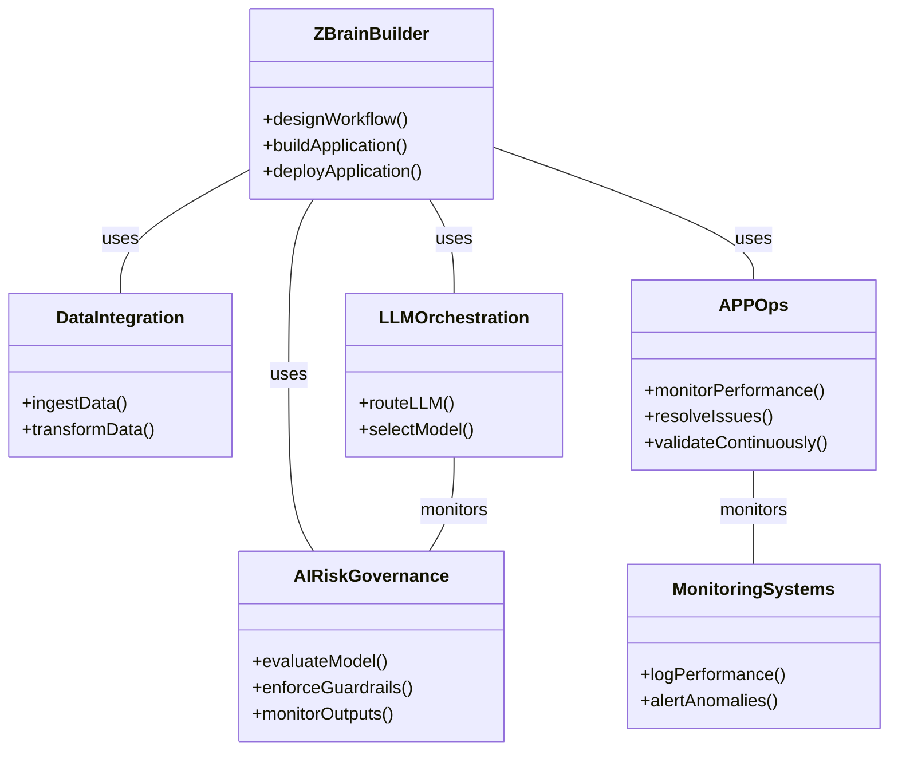

# ZBrain.ai: The Enterprise-Grade Generative AI Orchestration Platform

> Streamline AI workflows, enhance productivity, and optimize operations with ZBrain.ai, the leading *Generative AI Orchestration Platform* for enterprises.

## Executive Summary

*ZBrain.ai* is a comprehensive *generative AI orchestration platform* designed for enterprise use. It provides a *low-code/no-code* environment for developing, deploying, and managing custom *AI applications* and *AI agents*. The platform's modular architecture, focus on *data security* and *compliance*, and seamless integration with existing business systems make it a valuable tool for enterprises seeking to leverage AI to improve *operational efficiency*, *customer engagement*, and *decision-making*. This document provides a detailed overview of *ZBrain.ai*, covering its architecture, key components, implementation considerations, integration scenarios, performance benchmarks, and future implications.

## Table of Contents

1.  [Introduction](#introduction)
    *   [What is ZBrain.ai?](#what-is-zbrainai)
    *   [Key Takeaways](#key-takeaways)
2.  [Technical Deep Dive](#technical-deep-dive)
    *   [Architecture](#architecture)
    *   [Components](#components)
        *   [Data Integration and Ingestion](#data-integration-and-ingestion)
        *   [LLM Orchestration Layer](#llm-orchestration-layer)
        *   [ZBrain Builder Engine](#zbrain-builder-engine)
        *   [AI Risk Governance](#ai-risk-governance)
        *   [APPOps](#appops)
3.  [Applications in AI](#applications-in-ai)
4.  [Integration & Use Cases](#integration--use-cases)
5.  [FAQ](#faq)

## Introduction

### What is ZBrain.ai?

*ZBrain.ai* is an *enterprise-grade generative AI orchestration platform* that enables businesses to build custom *AI applications* and *AI agents* using a *low-code/no-code* interface. It streamlines workflows, amplifies productivity, and optimizes operations by providing a comprehensive environment to develop, deploy, and manage *AI* solutions. It empowers businesses to develop custom *generative AI* solutions and *AI agents* without requiring deep *AI* expertise. It enables *AI Enablement* and streamlines *Workflow Automation*, leading to increased *Operational Efficiency*. ZBrain combines an AI readiness assessment framework with a powerful implementation engine, allowing businesses to evaluate their *AI readiness*, identify opportunities, create intelligent agents, and seamlessly integrate *AI* into their existing systems. The platform leverages various Large Language Models (*LLMs*) like *GPT-4*, *Claude*, *Llama-3*, and *Gemini* to build secure applications tailored to specific business needs.

### Key Takeaways

*   *ZBrain.ai* is a leading *Generative AI Orchestration Platform* for enterprises.
*   It offers a *low-code/no-code* environment for *AI application* development.
*   Key features include *data integration*, *LLM orchestration*, *AI Risk Governance*, and *APPOps*.
*   It can be used for a wide range of applications, including *customer support automation* and *fraud detection*.
*   The platform leverages diverse *LLMs* like *GPT-4*, *Claude*, *Llama-3*, and *Gemini* to build secure applications tailored to specific business needs.

## Technical Deep Dive

### Architecture

*ZBrain* features a modular architecture, designed for flexibility and scalability. Key modules, also referred to as "building blocks", are:

*   *Data Integration and Ingestion*
*   *LLM Orchestration Layer*
*   *ZBrain Builder Engine*
*   *AI Risk Governance*
*   *APPOps*

### Components

#### Data Integration and Ingestion

Connectors and pipelines to ingest data from various sources (*documents*, *databases*, *APIs*, etc.). This component is vital for ensuring *AI Readiness*. It simplifies sourcing data from databases, cloud storage, and APIs (integrates with services like *MySQL*, *SQL*, *MongoDB*, *Amazon AWS*, *Google Cloud*, *Azure Cloud*). This component performs *ETL* (Extract, Transform, Load) for storing data in a knowledge base.

*   **Technical Details:** Utilizes standard *data connectors* (e.g., *JDBC*, *ODBC*, *REST APIs*) and potentially custom connectors for proprietary systems. Includes *data transformation* and *cleansing* capabilities, performing *ETL* (Extract, Transform, Load) for storage in the knowledge base.
*   **Integration Points:**
    *   *Databases* (*SQL*, *NoSQL*)
    *   *Cloud storage* (*AWS S3*, *Azure Blob Storage*, *Google Cloud Storage*)
    *   *APIs* (*REST*, *GraphQL*)
    *   *File systems* (local, network)

#### LLM Orchestration Layer

Model-agnostic approach to *LLM Orchestration*, supporting various *AI models* simultaneously (e.g., *GPT-4*, *Claude*, *Llama-3*, *Gemini*). This layer intelligently routes and switches between different *LLMs* based on specific requirements, ensuring optimal performance for various applications. The model-agnostic platform flexibly integrates with public and private *LLMs*.

*   **Technical Details:** Abstracts the underlying *LLM APIs*, providing a unified interface for interacting with different models. Implements *model selection* and *routing logic*, potentially based on cost, performance, or specific task requirements. Employs techniques like *prompt engineering* and *chain-of-thought* reasoning.
*   **Integration Points:**
    *   *OpenAI API*
    *   *Anthropic API*
    *   *Hugging Face Transformers*
    *   *Google AI Platform*
    *   Self-hosted *LLMs*

#### ZBrain Builder Engine

Implementation and orchestration layer that ties the components together. Includes a *low-code builder* interface for designing *AI applications*, providing a visual development environment for creating and configuring *AI workflows*. The core engine handles business logic execution, enforces data and user governance, and facilitates run-time integrations with other systems. This *low-code/no-code* platform forms the core of the *ZBrain* ecosystem, offering an intuitive interface for designing, building, and deploying *AI*-powered solutions.

*   **Technical Details:** Employs a drag-and-drop interface and pre-built components for common tasks. Generates code or configuration files based on the visual design.
*   **Integration Points:**
    *   *Data Integration and Ingestion* module
    *   *LLM Orchestration Layer* module
    *   *AI Risk Governance* module
    *   *APPOps* module

#### AI Risk Governance

Includes evaluation suites and guardrails to ensure the quality and control of *AI outputs*. This is important for *AI Risk Governance*. It includes tools for evaluating *AI applications*, ensuring ongoing validation and monitoring of *AI outputs*. It implements guardrails to control *AI outputs* and leverages *LLMs* to assess the results of applications, ensuring consistent and reliable performance.

*   **Technical Details:** Includes tools for evaluating model performance (e.g., *accuracy*, *precision*, *recall*). Implements guardrails to prevent unintended or harmful outputs (e.g., *toxicity filters*, *bias detection*). Provides mechanisms for monitoring and auditing *AI applications*.
*   **Integration Points:**
    *   *LLM Orchestration Layer* module
    *   *ZBrain Builder Engine* module
    *   *Monitoring and logging systems*

#### APPOps

Ensures the seamless operation of *AI applications* through continuous background validation and proactive issue resolution. ZBrain's application operations (*APPOps*) capabilities ensure the smooth and reliable operation of *AI applications* by performing continuous background validation to identify and address issues proactively. Service monitoring capabilities track performance and health, ensuring high reliability and uptime.

*   **Technical Details:** Monitors *AI application* performance and health. Detects and alerts on anomalies and errors. Provides automated remediation capabilities. Supports *continuous integration* and *continuous delivery* (*CI/CD*) for *AI applications*. It also provides comprehensive service monitoring capabilities to track the performance and condition of *AI applications*, ensuring their efficient and effective operation.
*   **Integration Points:**
    *   *Monitoring and logging systems*
    *   *Alerting systems*
    *   *CI/CD pipelines*

## Applications in AI

| Application                                 | Description                                                                                                                                       |
| :------------------------------------------ | :------------------------------------------------------------------------------------------------------------------------------------------------ |
| *Custom ChatGPT Application Development*     | Build custom *ChatGPT* experiences.                                                                                                               |
| *AI Agent Creation and Deployment*           | Automate tasks and processes with tailored *AI agents*.                                                                                           |
| *Customer Support Automation*                | Deliver tailored and intelligent responses.                                                                                                       |
| *Internal Workflow Streamlining*             | Automate a broad range of *IT* tasks.                                                                                                              |
| *Data Analysis and Insight Generation*       | Analyze data, extract valuable insights, and generate comprehensive reports.                                                                       |
| *Compliance Monitoring and Automation*       | Automate *IT* compliance and audit processes.                                                                                                      |
| *HR and recruitment process optimization*    | Optimize resume screening and candidate matching.                                                                                                |
| *Fraud detection in financial transactions* | Detect fraudulent activities in financial processes.                                                                                             |

## Integration & Use Cases

| Scenario                       | Tech Stack                             | Considerations                                                                                                                                                                                    | Benefits                                                                                             |
| :----------------------------- | :------------------------------------- | :------------------------------------------------------------------------------------------------------------------------------------------------------------------------------------------------ | :--------------------------------------------------------------------------------------------------- |
| Customer Support Automation  | ZBrain.ai, Zendesk API, GPT-4        | Map Zendesk fields to LLM prompts. Configure AI Risk Governance to prevent bad responses. Monitor response times and customer satisfaction.                                                     | Improved satisfaction, reduced costs, faster response times.                                       |
| Fraud Detection              | ZBrain.ai, SQL database, Llama 3       | Integrate real-time transaction data. Train the LLM on historical fraud data. Set up alerts for suspicious transactions. Ensure compliance.                                                         | Reduced fraud losses, improved compliance, faster fraud detection.                                   |
| HR Process Optimization        | ZBrain.ai, Lever API, PaLM 2          | Integrate with HR systems for seamless resume screening, candidate matching, bias detection.                                                                                                    | Improved efficiency, better matching, reduced bias.                                                 |

## FAQ

**Q: What is *ZBrain.ai* and how does it work?**
A: *ZBrain.ai* is an *enterprise-grade generative AI platform* that allows businesses to build, deploy, and manage custom *AI solutions*. It uses a *low-code/no-code* interface and integrates with various *LLMs* and data sources.

**Q: How can *ZBrain* improve *enterprise AI workflows*?**
A: *ZBrain* enhances *AI workflows* through *AI orchestration*, *workflow automation*, simplified *data integration*, and streamlined *AI application* development.

**Q: What are the benefits of using a *low-code AI platform* like *ZBrain*?**
A: Benefits include faster *AI application development*, reduced development costs, increased accessibility for non-technical users, and improved *operational efficiency*.

**Q: How does *ZBrain* ensure *data security* and *compliance*?**
A: *ZBrain* provides robust *data security* and *AI risk governance* features, including data encryption, access control, security audits, and compliance with data privacy regulations like *GDPR* and *CCPA*.
